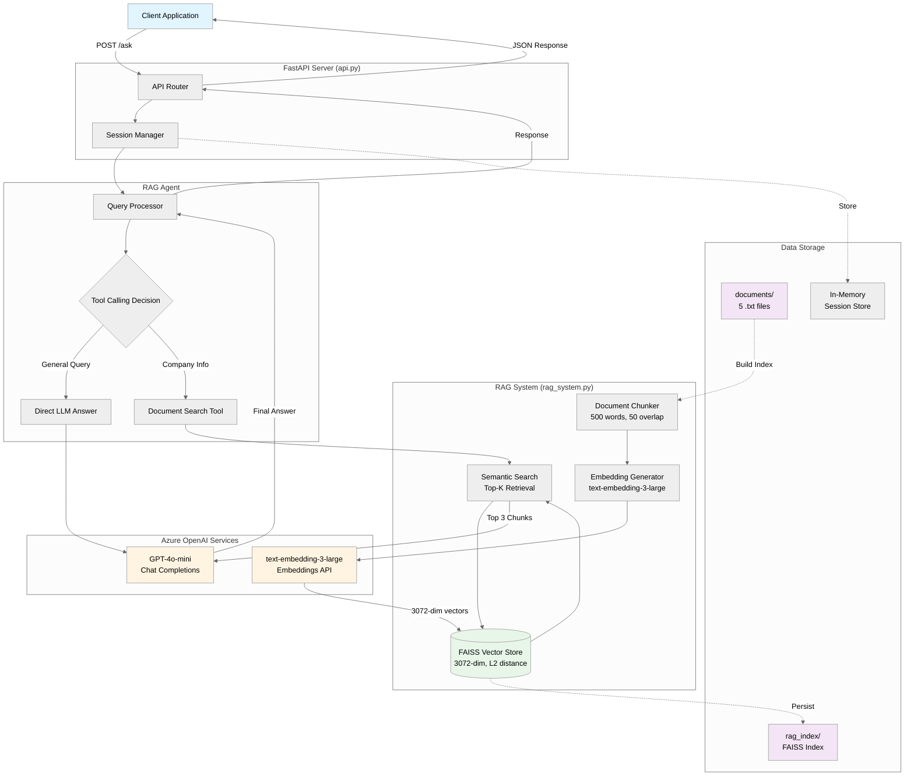
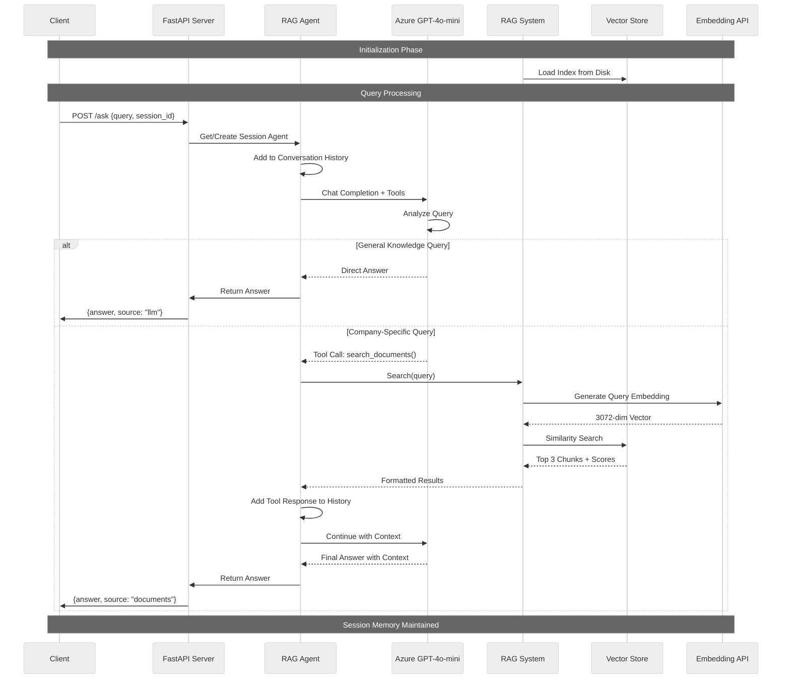
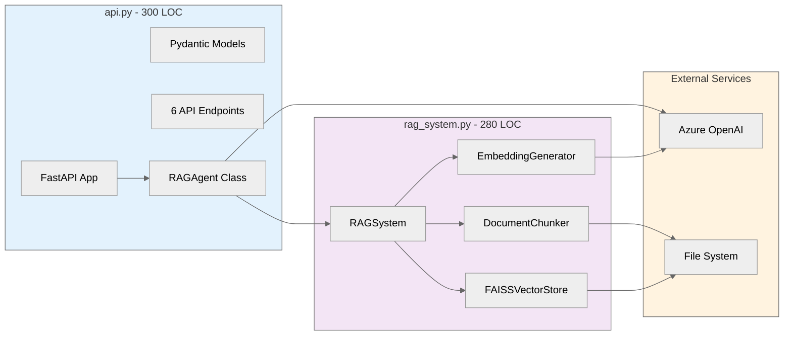

# AI Support Agent 🤖

**Intelligent RAG-powered support agent with Azure OpenAI**

An AI agent that answers questions using either direct LLM knowledge or retrieves relevant information from your documents using semantic search (RAG). Exposed via a clean REST API built with FastAPI.

---

## 📋 Table of Contents

- [Architecture](#-architecture)
- [Features](#-features)
- [Quick Start](#-quick-start)
- [API Usage](#-api-usage)
- [Project Structure](#-project-structure)
- [Testing](#-testing)

---

## 🏗️ Architecture

### Simple Architecture Overview

```
┌─────────────────────────────────────────────────────────────────────┐
│                            CLIENT                                   │
│                   (Web, Mobile, curl, etc.)                         │
└────────────────────────────┬────────────────────────────────────────┘
                             │
                    POST /ask {query, session_id}
                             │
                             ▼
┌─────────────────────────────────────────────────────────────────────┐
│                      FASTAPI SERVER (api.py)                        │
│  ┌───────────────────────────────────────────────────────────────┐  │
│  │ 1. Receive Request                                            │  │
│  │ 2. Get/Create Session → Each session has its own RAG Agent    │  │
│  │ 3. Pass query to Agent                                        │  │
│  └───────────────────────────────────────────────────────────────┘  │
└────────────────────────────┬────────────────────────────────────────┘
                             │
                             ▼
┌────────────────────────────────────────────────────────────────────┐
│                      RAG AGENT (api.py)                            │
│  ┌────────────────────────────────────────────────────────────┐    │
│  │ Process Query with Conversation History                    │    │ └───────────────────────────────────────────────────────────────┘    │
│                             │                                      │
│                             ▼                                      │
│              ┌──────────────────────────────┐                      │
│              │  Azure OpenAI GPT-4o-mini    │                      │
│              │  (Function Calling Enabled)  │                      │
│              └──────────────┬───────────────┘                      │
│                             │                                      │
│              ┌──────────────┴──────────────┐                       │
│              │                             │                       │
│              ▼                             ▼                       │
│      ┌─────────────┐              ┌───────────────┐                │
│      │   General   │              │  Company Info │                │
│      │   Question  │              │    Question   │                │
│      │             │              │               │                │
│      │ "What is    │              │ "How many     │                │
│      │  Python?"   │              │  remote days?"│                │
│      └──────┬──────┘              └───────┬───────┘                │
│             │                             │                        │
│             │                             │ Call Tool:             │
│             │                             │ search_documents()     │
│             │                             │                        │
└─────────────┼─────────────────────────────┼────────────────────────┘
              │                             │
              │                             ▼
              │              ┌──────────────────────────────────────┐
              │              │   RAG SYSTEM (rag_system.py)         │
              │              │  ┌────────────────────────────────┐  │
              │              │  │ 1. Convert query → embedding   │  │
              │              │  │    (text-embedding-3-large)    │  │
              │              │  │                                │  │
              │              │  │ 2. Search FAISS Vector Store   │  │
              │              │  │    (3072-dim, L2 similarity)   │  │
              │              │  │                                │  │
              │              │  │ 3. Return top 3 chunks         │  │
              │              │  │    with source files           │  │
              │              │  └────────────────────────────────┘  │
              │              └──────────────┬───────────────────────┘
              │                             │
              │                             │ Document chunks
              │                             │ as context
              │              ┌──────────────┴──────────────┐
              │              │                             │
              │              ▼                             │
              │       ┌─────────────────────────┐          │
              │       │   Azure OpenAI GPT-4o   │          │
              │       │   Generate answer with  │          │
              │       │   retrieved context     │          │
              │       └─────────────┬───────────┘          │
              │                     │                      │
              ▼                     ▼                      │
        Direct Answer         Answer + Sources             │
              │                     │                      │
              └──────────┬──────────┘                      │
                         │                                 │
                         ▼                                 │
              ┌────────────────────┐                       │
              │  Response to API   │                       │
              └──────────┬─────────┘                       │
                         │                                 │
                         ▼                                 │
              ┌────────────────────────────────┐           │
              │ {                              │           │
              │   "answer": "...",             │           │
              │   "source": "llm|documents",   │           │
              │   "session_id": "..."          │           │
              │ }                              │           │
              └────────────────────────────────┘           │
                                                           │
DATA STORAGE:                                              │
┌──────────────────┐  ┌─────────────────┐                  │
│   documents/     │  │   rag_index/    │◄─────────────────┘
│ - policies.txt   │  │ - index.faiss   │  Built from docs
│ - handbook.txt   │  │ - chunks.pkl    │  13 chunks total
│ - faq.txt        │  │ - metadata.pkl  │
│ - security.txt   │  └─────────────────┘
│ - technical.txt  │
└──────────────────┘
```

**Key Points:**

- **2 Paths**: Direct LLM answer OR Document search via RAG
- **Smart Routing**: AI automatically decides which path to use
- **Session Memory**: Each session maintains its own conversation history
- **Source Tracking**: Know if answer came from LLM knowledge or documents

---

### Detailed Mermaid Diagrams

> **Note**: Install the [Mermaid extension](https://marketplace.visualstudio.com/items?itemName=bierner.markdown-mermaid) in VS Code to see these diagrams rendered, or view on GitHub.

#### System Architecture Diagram



### Data Flow Diagram



### Component Architecture



### How It Works

1. **Client** sends a question via REST API (`POST /ask`)
2. **FastAPI** router creates/retrieves session and initializes RAG Agent
3. **RAG Agent** uses Azure OpenAI's function calling to intelligently decide:
   - Answer directly from LLM knowledge (general queries)
   - OR invoke document search tool (company-specific queries)
4. **RAG System** (if document search triggered):
   - Converts query to 3072-dimensional embedding
   - Searches FAISS vector store using L2 similarity
   - Returns top 3 most relevant document chunks with scores
5. **Azure OpenAI** generates final answer using retrieved context
6. **Response** returned as JSON with answer, source attribution, and session ID

---

## ✨ Features

- ✅ **Semantic Search**: FAISS vector database with 3072-dim embeddings
- ✅ **Smart Routing**: AI decides when to search documents vs answer directly
- ✅ **Session Memory**: Maintains conversation context per session
- ✅ **REST API**: FastAPI with automatic OpenAPI docs
- ✅ **Document Chunking**: Intelligent 500-word chunks with overlap
- ✅ **Source Attribution**: Tracks which documents were used

---

## 🚀 Quick Start

### 1. Install Dependencies

```bash
pip install -r requirements.txt
```

### 2. Set Up Environment

Create a `.env` file with your Azure OpenAI credentials:

```env
AZURE_OPENAI_API_KEY=your-api-key-here
AZURE_OPENAI_ENDPOINT=https://your-resource.openai.azure.com/
AZURE_OPENAI_DEPLOYMENT=your-chat-deployment-name
AZURE_OPENAI_EMBEDDING_DEPLOYMENT=your-embedding-deployment-name
AZURE_OPENAI_API_VERSION=2024-12-01-preview
```

### 3. Build RAG Index

```bash
python rag_system.py
```

This will:

- Load documents from `documents/` folder
- Split them into chunks
- Generate embeddings
- Build FAISS index
- Save to `rag_index/` folder

### 4. Start the API Server

```bash
uvicorn api:app --reload
```

Server will start at `http://127.0.0.1:8000`

---

## 📡 API Usage

### Interactive API Docs

Open in your browser:

- **Swagger UI**: http://127.0.0.1:8000/docs
- **ReDoc**: http://127.0.0.1:8000/redoc

### Ask a Question

```bash
curl -X POST "http://127.0.0.1:8000/ask" \
  -H "Content-Type: application/json" \
  -d '{
    "query": "What is our remote work policy?",
    "session_id": "user123"
  }'
```

**Response:**

```json
{
  "answer": "Our remote work policy allows employees to work remotely up to 3 days per week...",
  "source": "documents",
  "session_id": "user123"
}
```

### All Available Endpoints

- `GET /` - Health check
- `POST /ask` - Ask a question
- `GET /sessions` - List all active sessions
- `DELETE /sessions/{session_id}` - Clear a session
- `POST /rebuild-index` - Rebuild RAG index
- `GET /health` - API health status

---

## 📁 Project Structure

```
Ai-Support-Agent/
│
├── api.py                    # FastAPI server + RAG Agent
├── rag_system.py            # RAG implementation (chunking, embeddings, FAISS)
├── requirements.txt         # Python dependencies
├── README.md               # This file
│
├── .env                    # Azure OpenAI credentials (create this)
│
├── documents/              # Knowledge base documents
│   ├── company_policies.txt
│   ├── employee_handbook.txt
│   ├── product_faq.txt
│   ├── security_policy.txt
│   └── technical_docs.txt
│
└── rag_index/             # FAISS vector store (auto-generated)
    ├── index.faiss
    ├── chunks.pkl
    └── metadata.pkl
```

### File Descriptions

- **`api.py`**: Complete FastAPI application with RAG-powered agent, session management, and all endpoints
- **`rag_system.py`**: RAG pipeline - document chunking, embedding generation, FAISS vector store, semantic search
- **`documents/`**: Your knowledge base - add more `.txt` files here and rebuild the index
- **`rag_index/`**: Persisted FAISS index - automatically created when you run `rag_system.py`

---

## 🧪 Testing

### Test with Python

```python
import requests

response = requests.post(
    "http://127.0.0.1:8000/ask",
    json={
        "query": "How many days of annual leave?",
        "session_id": "test"
    }
)
print(response.json())
```

### Test with curl

```bash
# General question (uses LLM knowledge)
curl -X POST http://127.0.0.1:8000/ask \
  -H "Content-Type: application/json" \
  -d '{"query": "What is Python?", "session_id": "test"}'

# Document question (uses RAG)
curl -X POST http://127.0.0.1:8000/ask \
  -H "Content-Type: application/json" \
  -d '{"query": "What is our security policy?", "session_id": "test"}'

# Follow-up (uses session memory)
curl -X POST http://127.0.0.1:8000/ask \
  -H "Content-Type: application/json" \
  -d '{"query": "Tell me more about that", "session_id": "test"}'
```

---

## 📚 Adding New Documents

1. Add `.txt` files to the `documents/` folder
2. Rebuild the index:
   ```bash
   python rag_system.py
   ```
   OR call the API:
   ```bash
   curl -X POST http://127.0.0.1:8000/rebuild-index
   ```
3. New documents are now searchable!

---

## 🔧 Configuration

Edit `.env` to change:

- Azure OpenAI model/deployment
- API version
- Endpoint URL

Edit `rag_system.py` to adjust:

- Chunk size (default: 500 words)
- Chunk overlap (default: 50 words)
- Top-k results (default: 3)

Edit `api.py` to modify:

- System prompts
- API endpoints
- Session management

---

## � What Was Built - Task Summary

### Task 1: AI Agent Development ✅

**Objective**: Build an AI agent with tool calling capabilities

**What Was Implemented**:

- ✅ **Azure OpenAI Integration**: Connected to gpt-4o-mini model for chat completions
- ✅ **Tool Calling System**: Implemented function calling with `search_documents()` tool
- ✅ **Prompt Engineering**: Created system prompts that instruct the AI to:
  - Answer general questions directly using LLM knowledge
  - Automatically invoke document search for company-specific queries
  - Decide intelligently when to use which approach
- ✅ **Session Memory**: Built conversation history tracking that:
  - Maintains context across multiple queries
  - Persists per session ID
  - Enables follow-up questions
- ✅ **Agent Architecture**: Created `RAGAgent` class in [api.py](api.py) with:
  - `process_query()` method for handling user input
  - `search_documents()` method for document retrieval
  - Automatic tool execution and response generation

**Technical Details**:

- Model: `gpt-4o-mini` (Azure OpenAI)
- Tool: Function calling with JSON schema
- Memory: List-based conversation history with role-based messages

---

### Task 2: RAG Implementation ✅

**Objective**: Implement Retrieval-Augmented Generation with document embeddings

**What Was Implemented**:

- ✅ **5 Sample Documents Created**:

  1. `company_policies.txt` - Remote work policy, leave policies, code of conduct
  2. `employee_handbook.txt` - Benefits, compensation, working hours
  3. `product_faq.txt` - CloudSync Pro product information, pricing, features
  4. `security_policy.txt` - Encryption standards, access control, compliance
  5. `technical_docs.txt` - API documentation, authentication, rate limits

- ✅ **Document Chunking System** ([rag_system.py](rag_system.py)):

  - `DocumentChunker` class splits documents into 500-word chunks
  - 50-word overlap between chunks for context preservation
  - Maintains metadata (source filename) for each chunk

- ✅ **Embedding Generation**:

  - Model: `text-embedding-3-large` (Azure OpenAI)
  - Vector dimensions: 3072-dimensional embeddings
  - Auto-detection of embedding dimensions
  - Batch processing for efficiency

- ✅ **FAISS Vector Store**:

  - `FAISSVectorStore` class for similarity search
  - L2 distance metric (IndexFlatL2)
  - Stores 13 total chunks from 5 documents
  - Persistence to disk in `rag_index/` folder

- ✅ **Semantic Search**:
  - `RAGSystem` orchestrates the entire pipeline
  - Query → Embedding → FAISS Search → Top-K results
  - Returns top 3 most relevant chunks with scores
  - Source attribution for each result

**Technical Details**:

- Embeddings: `text-embedding-3-large` (3072-dim)
- Vector DB: FAISS with L2 similarity
- Chunks: 13 chunks, 500 words each, 50-word overlap
- Index saved to: `rag_index/index.faiss`, `chunks.pkl`, `metadata.pkl`

---

### Task 3: Backend API ✅

**Objective**: Create REST API using FastAPI

**What Was Implemented**:

- ✅ **FastAPI Application** ([api.py](api.py)):

  - Production-ready ASGI server with Uvicorn
  - CORS middleware for cross-origin requests
  - Auto-generated OpenAPI documentation at `/docs`
  - Pydantic models for request/response validation

- ✅ **6 API Endpoints**:

  1. `GET /` - Root endpoint with API info
  2. `POST /ask` - Main endpoint for asking questions
     - Input: `{query: str, session_id?: str}`
     - Output: `{answer: str, source: str, session_id: str}`
  3. `GET /health` - Health check with RAG index status
  4. `GET /sessions` - List all active sessions
  5. `DELETE /sessions/{session_id}` - Clear specific session
  6. `POST /rebuild-index` - Rebuild RAG index from documents

- ✅ **Session Management**:

  - In-memory session storage (dict-based)
  - Each session has its own `RAGAgent` instance
  - Maintains conversation history per session
  - Auto-generates UUID if no session_id provided

- ✅ **RAG Integration**:
  - Agent uses tool calling to decide: LLM vs Document search
  - Semantic search via FAISS when documents needed
  - Source tracking (returns "llm" or "documents")
  - Context-aware responses using conversation history

**Technical Details**:

- Framework: FastAPI with Uvicorn
- Port: 8000 (default)
- Session Storage: In-memory dictionary
- Response Format: JSON with answer, source, session_id
- Documentation: Auto-generated Swagger UI at `/docs`

---
